# Active Directory Home Lab (Windows Server 2022)

## Overview

This project documents a Windows Server 2022 Active Directory home lab built in Oracle VirtualBox. The purpose of the lab was to practice common help desk and MSP-style administration tasks in a controlled environment, including domain controller setup, Active Directory Domain Services (AD DS), DNS configuration, Organizational Units, user accounts, security groups, and basic identity administration.

## Lab Environment

| Component | Details |
|---|---|
| Virtualization | Oracle VirtualBox |
| Server OS | Windows Server 2022 Standard Evaluation |
| Server Name | DC01 |
| Domain | amanlab.local |
| NetBIOS Domain | AMANLAB |
| Static IP | 192.168.1.10 |
| Core Services | Active Directory Domain Services, DNS |

## Objectives

- Install and configure Windows Server 2022 in a virtual lab.
- Assign a static IPv4 address to the server.
- Install the Active Directory Domain Services role.
- Promote the server to a domain controller.
- Create a new Active Directory forest using `amanlab.local`.
- Access Active Directory Users and Computers (ADUC).
- Create Organizational Units for IT, HR, and Finance.
- Create a test domain user account.
- Create a security group.
- Practice user and group administration tasks.

## What Was Completed

### 1. Windows Server Setup

The lab started with a Windows Server 2022 virtual machine running inside Oracle VirtualBox. The server was configured and renamed as `DC01`.

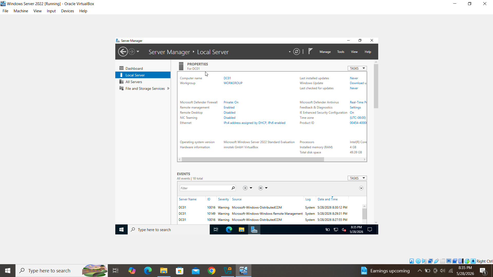

### 2. Static IP and DNS Configuration

A static IPv4 address was configured for the server. The preferred DNS server was set to the server's own IP address so it could act as the DNS server for the Active Directory domain.

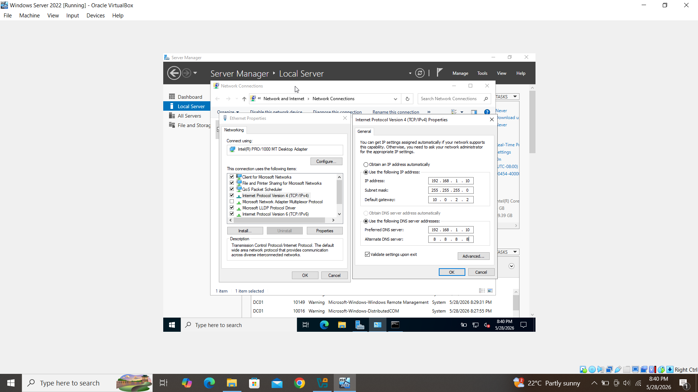

### 3. Active Directory Domain Services Installation

The Active Directory Domain Services role was selected and installed using Server Manager.

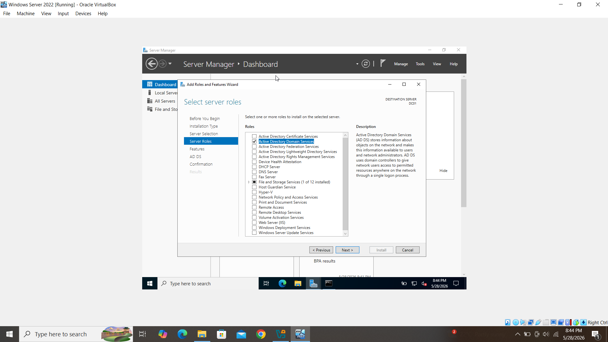

### 4. Domain Controller Promotion

The server was promoted to a domain controller by creating a new forest with the root domain name `amanlab.local`.

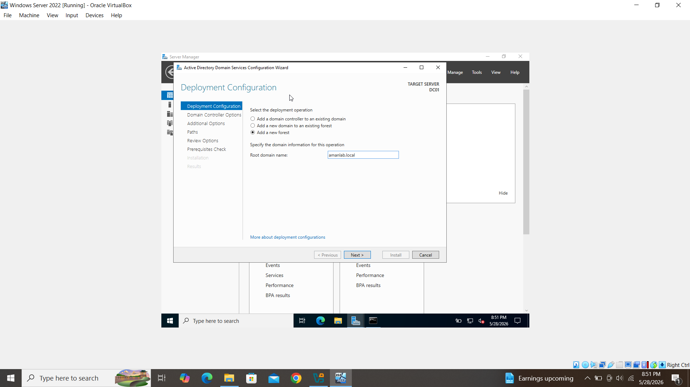

The prerequisites check completed successfully before the installation and promotion process continued.

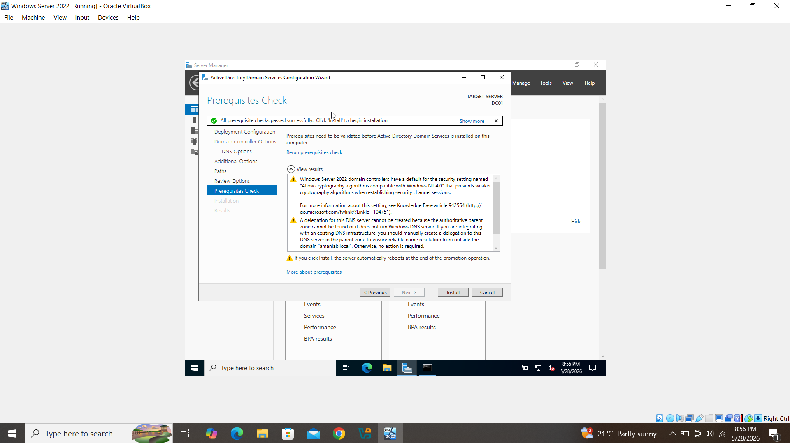

### 5. Domain Administrator Login

After promotion and reboot, the server was accessed using the `AMANLAB\Administrator` domain account.

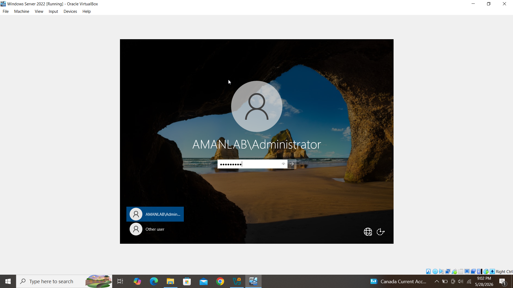

### 6. Active Directory Administration Tools

After AD DS was installed, Server Manager provided access to tools such as Active Directory Users and Computers, Active Directory Domains and Trusts, DNS, and Group Policy Management.

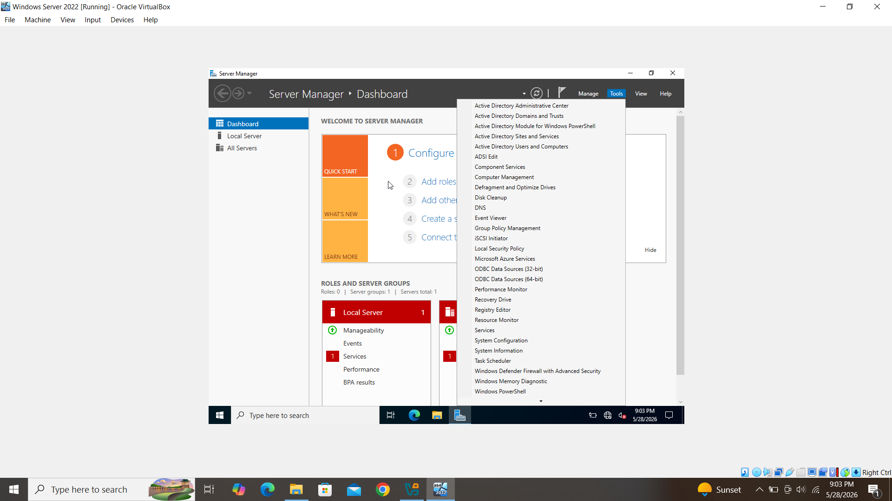

### 7. Active Directory Users and Computers

Active Directory Users and Computers was used to view and manage the `amanlab.local` domain structure.

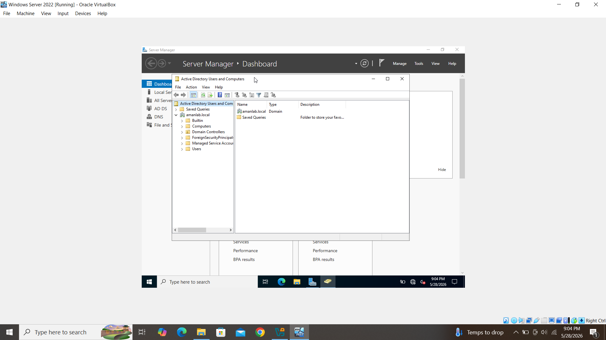

### 8. Organizational Units

Organizational Units were created to organize users and resources by department.

Created OUs:

- IT
- HR
- Finance

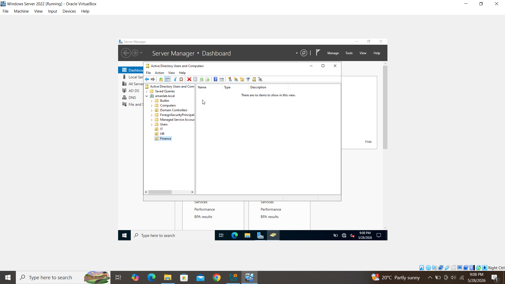

### 9. User Account Creation

A test user account was created in the IT Organizational Unit to practice user lifecycle administration.

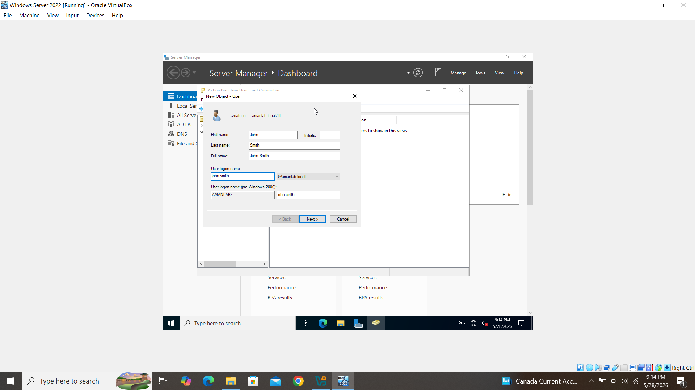

### 10. Security Group Creation

A security group named `IT Admins` was created to practice group-based access management.

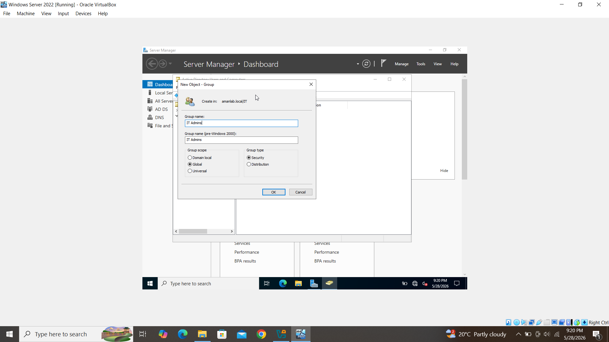

### 11. User and Group Administration

The lab included basic user and group management workflows such as adding users to groups and reviewing account administration options.

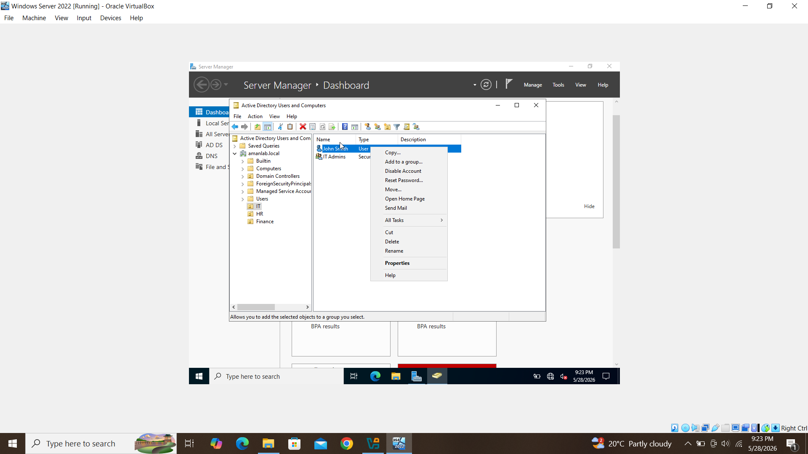

## Skills Demonstrated

- Windows Server 2022 administration
- Oracle VirtualBox virtualization
- Static IPv4 and DNS configuration
- Active Directory Domain Services installation
- Domain controller promotion
- New forest creation
- Active Directory Users and Computers (ADUC)
- Organizational Unit management
- User account creation
- Security group creation
- Basic identity and access management
- Help desk-style account administration workflow

## Notes

This was a home lab built for learning and interview preparation. It does not represent a production environment. The lab focused on foundational Active Directory administration tasks commonly seen in entry-level help desk, service desk, and MSP environments.

## Future Improvements

- Join a Windows client VM to the domain.
- Create additional test users for each department.
- Apply basic Group Policy Objects (GPOs).
- Configure shared folders and NTFS permissions.
- Practice account lockout and password reset troubleshooting.
- Document DNS records and domain-joined client testing.
